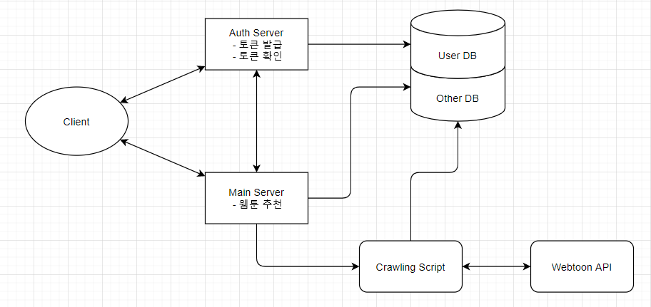

# 2차 중간 발표

### 목차

1. ##### 아키텍처

2. ##### 시퀀스 다이어그램

3. ##### ERD (Entity Relationship Diagram)

4. ##### 와이어 프레임

   1. ##### 추천화면

   2. ##### 메인 화면, 상세 페이지

   3. ##### 회원가입, 로그인

   4. ##### 프로필 수정

   5. ##### 내 리스트

5. ##### 실행 부분 캡처

   1. ##### 네이버 웹툰 크롤링 csv파일

   2. ##### 다음 웹툰 크롤링 csv파일

* ### 아키텍처

  * 

    
    

* ### 시퀀스 다이어그램

  * 

    
    

* ### ERD (Entity Relationship Diagram)

  * 

    
    

* ### 와이어 프레임

  * #### 추천 화면

    * .png)

    * .png)

    * .png)

      
      

  * #### 메인 화면, 상세 페이지

    * 

      
      

  * #### 회원가입, 로그인

    * 

      
      

  * #### 프로필 수정

    * 

      
      

  * #### 내 리스트

    * 

* ### 설계 완료 중 구현 할 부분에 대해서 실행 캡쳐

  * #### 네이버 웹툰 크롤링 결과 csv 파일

    * 

      
      

  * #### 다음 웹툰 크롤링 결과 csv 파일

    * 

      
      
