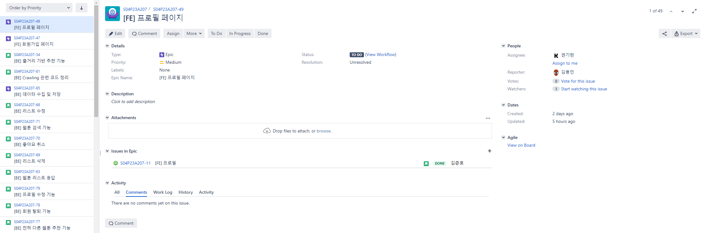
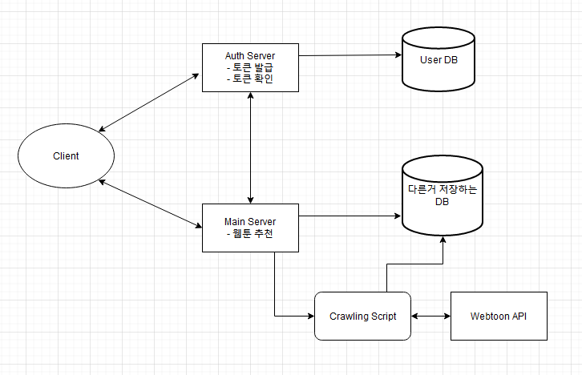
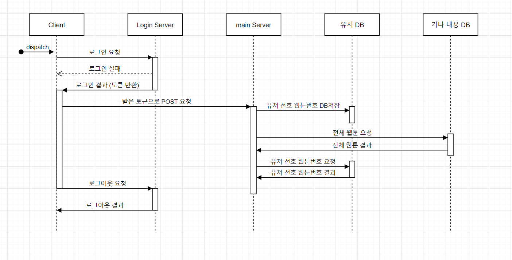
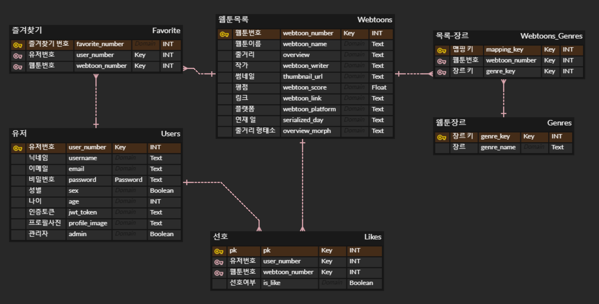
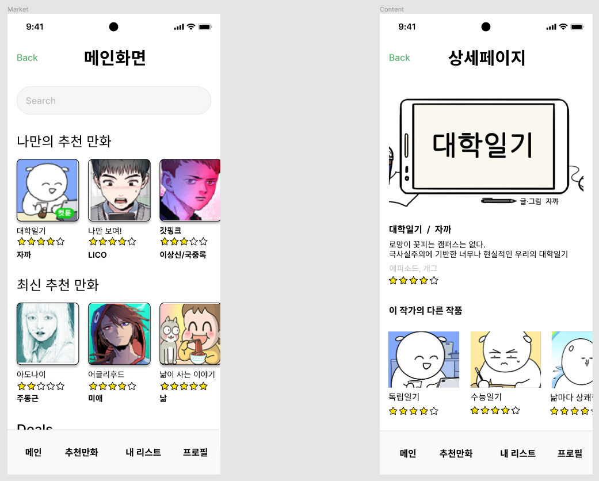
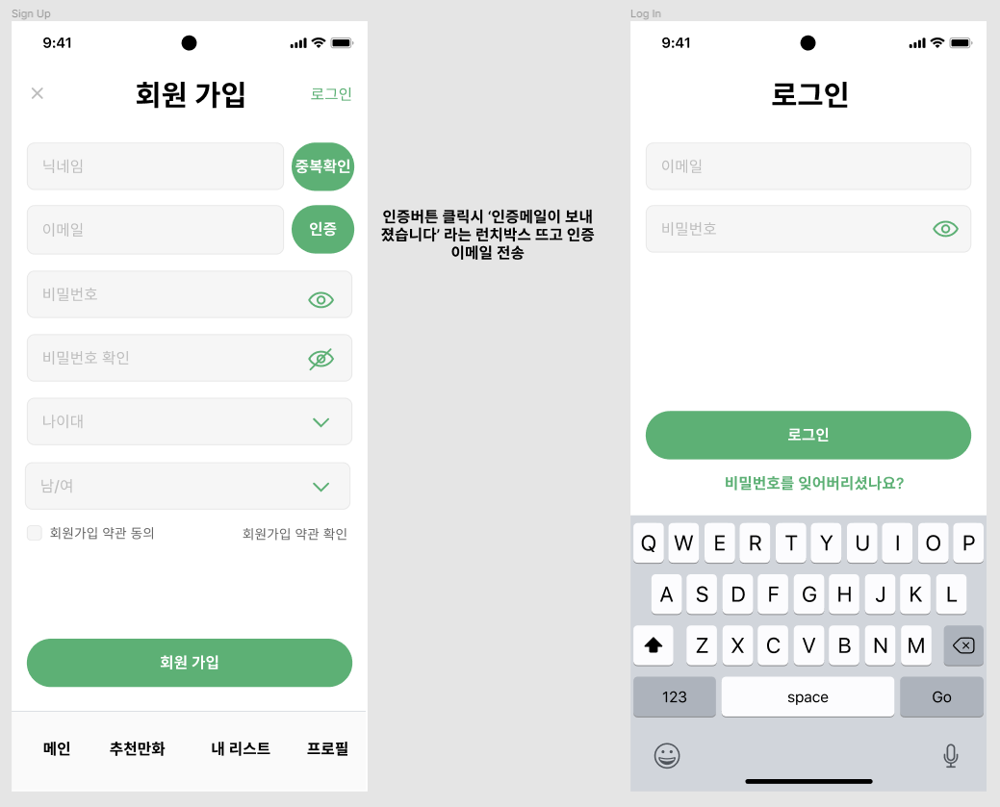
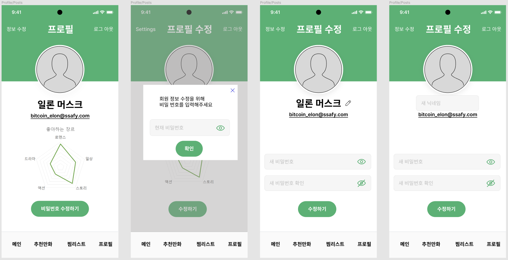
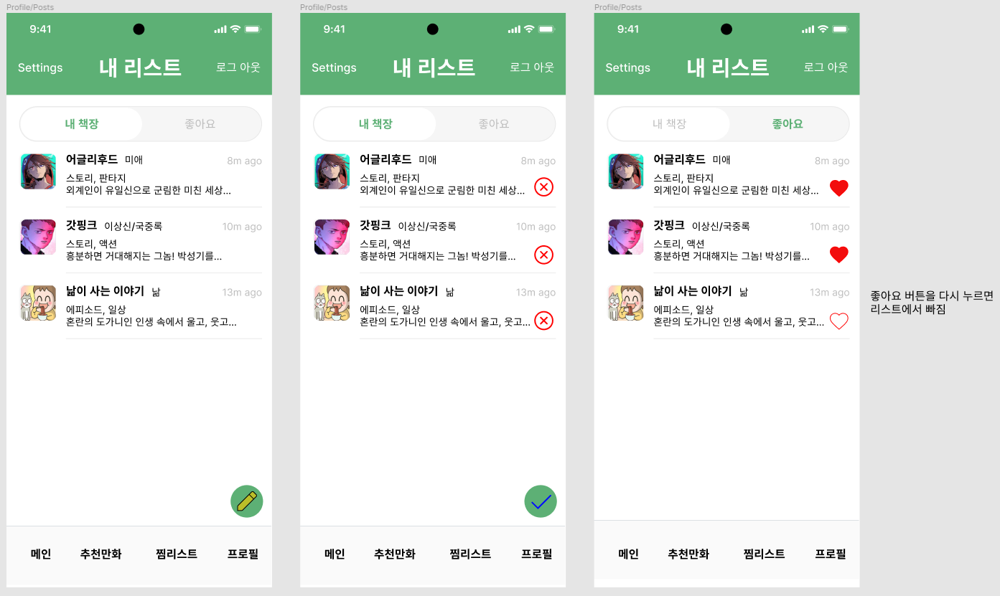
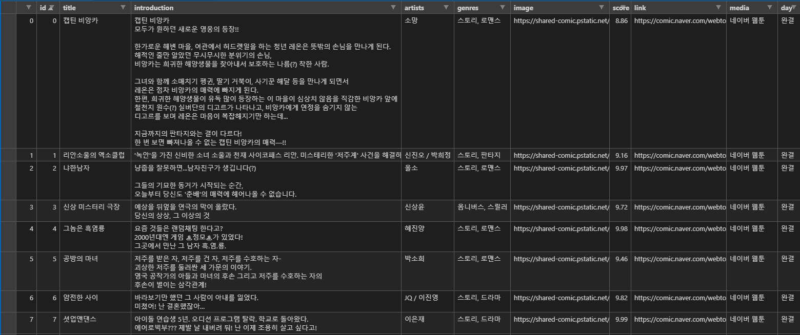
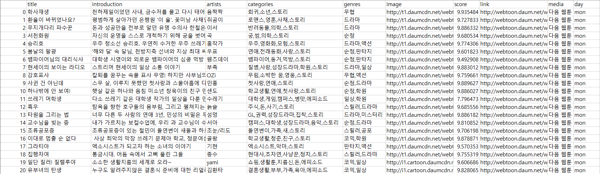

##### Tonndar : 스와이프 방식을 통한 웹툰 매칭 앱

##### Maintainer : 권기현, 김준호, 김용민, 손준희, 현성섭

## 목차

1. #### [Stack](#stack)

2. #### [Goal](#goal)

3. #### [Plan](#plan)

4. #### [Gitlab](#gitlab)

5. #### [Jira](#jira)

6. #### [아키텍처](#아키텍처)

7. #### [시퀀스 다이어그램](#시퀀스-다이어그램)

8. #### [ERD (Entity Relationship Diagram)](#erd-(entity-relationship-diagram))

9. #### [와이어 프레임](#와이어-프레임)

   1. ##### [추천화면](#추천화면)

   2. ##### [메인 화면, 상세 페이지](#메인-화면,-상세-페이지)

   3. ##### [회원가입, 로그인](#회원가입,-로그인)

   4. ##### [프로필 수정](#프로필-수정)

   5. ##### [내 리스트](#내-리스트)

10. #### [실행 부분 캡처](#실행-부분-캡처)

    1. ##### [네이버 웹툰 크롤링 csv파일](#네이버-웹툰-크롤링-csv파일)

    2. ##### [다음 웹툰 크롤링 csv파일](#다음-웹툰-크롤링-csv파일)

## Stack

* Back-end
  * Django, MYSQL Workbench, Python
* Front-end
  * dd
* Jira, Gitlab, Ubuntu, AWS

## Goal

> 아래 계획대로 기능을 구현중입니다.

* 사용자에게 웹툰을 추천
  * 스와이프 방식으로 얻은 사용자 정보(좋아요, 찜목록)에 기반한 유사성을 판단하여 추천
    * 목록 내 작가의 웹툰 추천
    * 장르별 유사도 계산 후 추천
    * 줄거리의 형태소 분석을 통한 유사도 계산 후 추천
    * 줄거리, 장르의 유사도와 떨어져 있는 새로운 웹툰 추천
  * 특정 유저의 정보가 아닌 범용적 정보에 기반한 추천
    * 최소한의 기준(별점)을 충족하는 웹툰 중 랜덤으로 추천
    * 장르별 평점이 높은 웹툰을 추천

## Plan

> 업무 분담
>
> * 백엔드 : 김용민, 손준희, 현성섭
> * 프론트엔드 : 권기현, 김준호

## Gitlab

> Gitlab을 이용하여 코드 관리를 하였습니다. Branch와 Commit규칙은 아래와 같습니다.
>
> * Branch rule : develop, frontend, backend로 나누고 이후에는 세부 기능마다 '_' 를 붙여서 merge를 대비하였습니다.
>   * develop
>     * frontend
>       * FE/Navbar
>       * FE/Auth
>     * backend
>       * BE/login_server
>       * BE/main_server
>         * BE/main_server_recomm
> * Commit rule : Jira Issue number, [BE+] / [FE+], Add / Edit / Delete, 세부사항 순으로 작성
>   * S04P23A207-62 [BE+] Add Custom UserAdmin and Static File settings
>   * S04P23A207-45 [FE+] Add redux, react-redux, redux-thunk and make redux constructure

## Jira

> Epic, Story를 통해서 해야할 일들을 분류하고 각각의 이슈들에 대해서 스토리 포인트, 담당자를 할당하였으며, 매주 스프린트를 진행하여 프로젝트를 진행하였습니다.

## 아키텍처

## 시퀀스 다이어그램

## ERD (Entity Relationship Diagram)

## 와이어 프레임

* #### 추천 화면

  .png)

  .png)

  .png)

  

* #### 메인 화면, 상세 페이지

  

  

* #### 회원가입, 로그인

  

  

* #### 프로필 수정

  

  

* #### 내 리스트

  

* ### 설계 완료 중 구현 할 부분에 대해서 실행 캡쳐

  * #### 네이버 웹툰 크롤링 결과 csv 파일

    

    

  * #### 다음 웹툰 크롤링 결과 csv 파일

    

    

