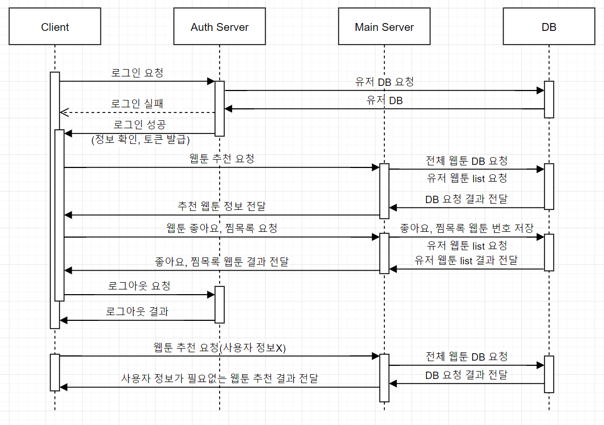

# Toonder

> 스와이프 방식을 통한 웹툰 매칭 앱

##### Maintainer : 권기현, 김준호, 김용민, 손준희, 현성섭

## 목차

- [Stack](#stack)
- [Goal](#goal)
- [Plan](#plan)
- [Gitlab](#gitlab)
- [Jira](#jira)
- [아키텍처](#아키텍처)
- [시퀀스 다이어그램](#시퀀스-다이어그램)
- [ERD (Entity Relationship Diagram)](#erd-(entity-relationship-diagram))
- [실행화면](#실행화면)
  - [메인페이지 / 추천화면](#메인페이지-/-추천화면)
  - [스와이프](#스와이프)
  - [찜목록 / 좋아요 리스트](#찜목록-/-좋아요-리스트)
  - [회원가입 / 로그인](#회원가입-/-로그인)

## Stack

* Back-end
  * Django, MYSQL Workbench, Python
* Front-end
  * React, Material UI, Styled components
* Jira, Gitlab, Ubuntu, AWS

## Goal

> 아래 계획대로 기능을 구현하였습니다.

* 사용자에게 웹툰을 추천
  * 스와이프 방식으로 얻은 사용자 정보(좋아요, 찜목록)에 기반한 유사성을 판단하여 추천
    * 목록 내 작가의 웹툰 추천
    * 장르별 유사도 계산 후 추천
    * 줄거리의 형태소 분석을 통한 유사도 계산 후 추천
    * 줄거리, 장르의 유사도와 떨어져 있는 새로운 웹툰 추천
  * 특정 유저의 정보가 아닌 범용적 정보에 기반한 추천
    * 최소한의 기준(별점)을 충족하는 웹툰 중 랜덤으로 추천
    * 장르별 평점이 높은 웹툰을 추천

## Plan

> 업무 분담
>
> * 백엔드 : 김용민, 손준희, 현성섭
> * 프론트엔드 : 권기현, 김준호

## Gitlab

> Gitlab을 이용하여 코드 관리를 하였습니다. Branch와 Commit규칙은 아래와 같습니다.
>
> * Branch rule : develop, frontend, backend로 나누고 이후에는 세부 기능마다 '_' 를 붙여서 merge를 대비하였습니다.
>   * develop
>     * frontend
>       * FE/Navbar
>       * FE/Auth
>     * backend
>       * BE/login_server
>       * BE/main_server
>         * BE/main_server_recomm
> * Commit rule : Jira Issue number, [BE+] / [FE+], Add / Edit / Delete, 세부사항 순으로 작성
>   * S04P23A207-62 [BE+] Add Custom UserAdmin and Static File settings
>   * S04P23A207-45 [FE+] Add redux, react-redux, redux-thunk and make redux constructure

## Jira

> Epic, Story를 통해서 해야할 일들을 분류하고 각각의 이슈들에 대해서 스토리 포인트, 담당자를 할당하였으며, 매주 스프린트를 진행하여 프로젝트를 진행하였습니다.

## 아키텍처

## 시퀀스 다이어그램

## ERD (Entity Relationship Diagram)

## 실행화면

* #### 메인페이지 / 추천화면

  |                      메인페이지                      |                          추천화면                          |
  | :--------------------------------------------------: | :--------------------------------------------------------: |
  |  |  |

  

* #### 스와이프

  |                            패스                            |                          상세페이지                          |                           보러가기                           |                            좋아요                            |
  | :--------------------------------------------------------: | :----------------------------------------------------------: | :----------------------------------------------------------: | :----------------------------------------------------------: |
  |  |  |  |  |
  |                                                            |                       상세페이지 결과                        |                        보러가기 결과                         |                         좋아요 결과                          |
  |                                                            |  |  |  |

  

* #### 찜목록 / 좋아요 리스트

  |                          좋아요                          |                          찜목록                          |
  | :------------------------------------------------------: | :------------------------------------------------------: |
  |  |  |

  

* #### 회원가입, 로그인

  |                    프로필                    |                       비밀번호변경                       |
  | :------------------------------------------: | :------------------------------------------------------: |
  |  |  |

  

