# Backend

###  venv

1. python -m venv venv
2. source venv/Scripts/activate

## mySql table 쿼리문으로 만들기

- erdcloud에서 만들면 mysql 쿼리 형식으로 export 해준다

- 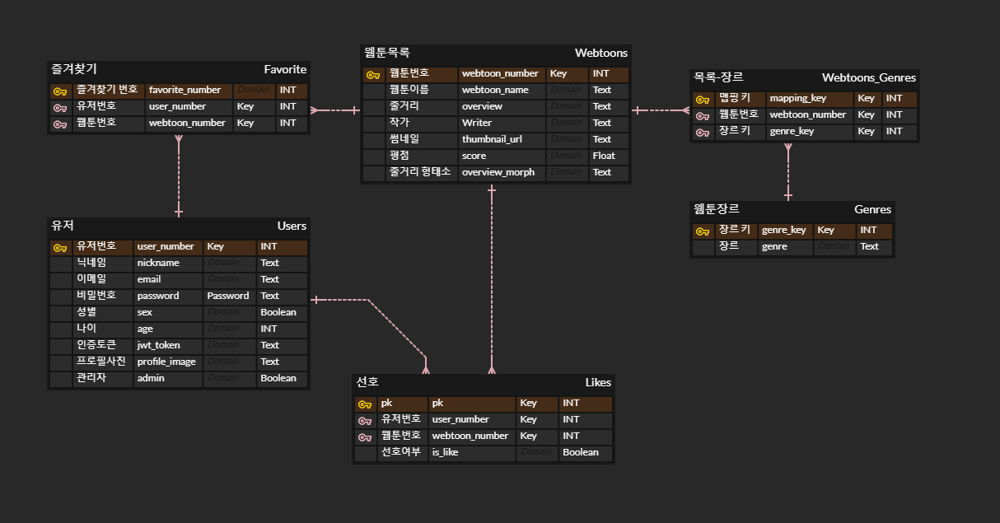
- 이렇게 erdcloud에 그려져있으면 밑에 export를 누른다.
- 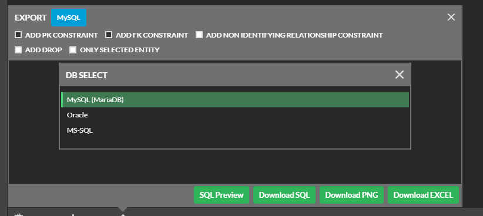

- 제일 위의 MySQL을 선택. (MariaDB: *MariaDB* Server is one of the most popular open source relational databases. It's made by the original developers of MySQL and guaranteed to stay open source)

- download해서 열어보면 이런애들이 뽑힌다. 

  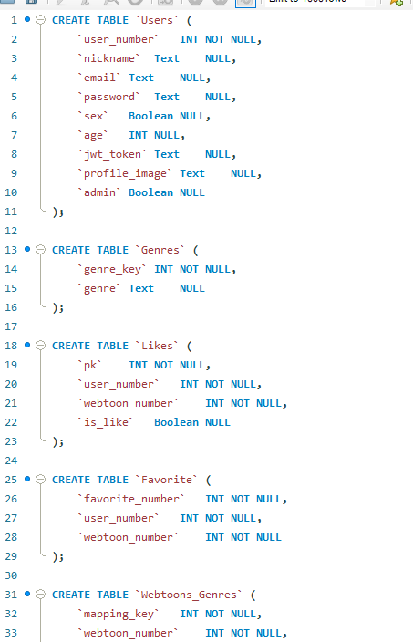

- 번개돌이 눌러서 실행하자

  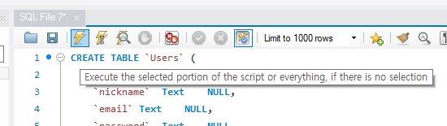

- 테이블들이 생성된다 신난다!

## MobaXterm 사용하기 

- putty보다 ui가 windows 친화적이라 가독성이 좋다

- portable 버전을 받아서 열어보면 이러하다.

  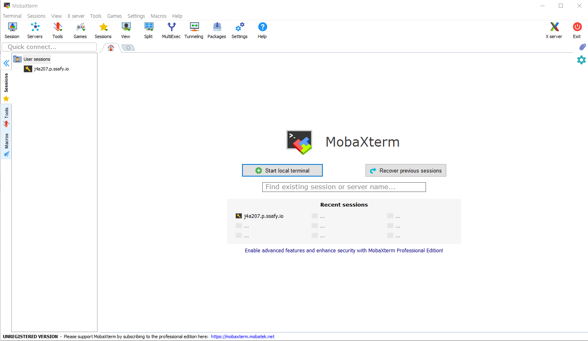

- 세션을 켜보자!

  ​	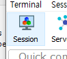

  

- 그다음은 ssh로 킨다.

  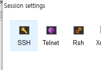

  

- 싸피에서 준 호스트 주소를 입력 (ex: ***.ssafy.io), Use private key를 선택하고 pem file을 첨부한다.

  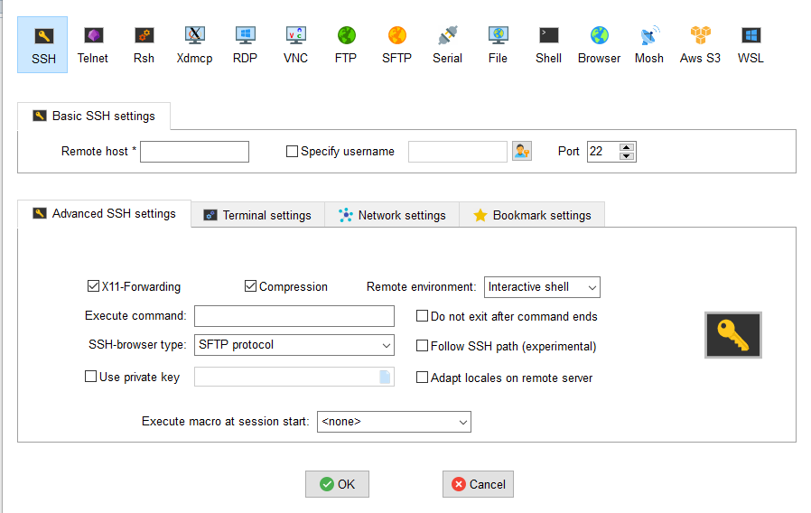

- login as ubuntu

  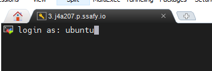

- 접속 성공! 신난다!

  

## Django <-> mySql 연결하기

### settings.py

- Databases 부분을 mysql과 연결할 수 있도록 교체한다
- 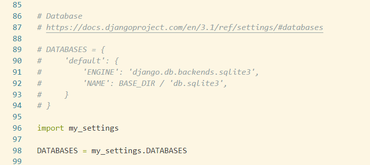
- 기본 database setting이 sqlite3로 잡혀있는데 전부 quote처리 해주자.
- 그리고 my_settings를 import 해주고(만들 파일) 그 아래에 DATABASES = my_settings.DATABASES 를 넣어주자

### my_settings.py

- manage.py와 같은 위치에 만들어 주면 된다. 

  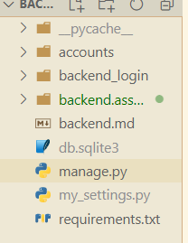

- 내용은 이렇게 입력해주자. name에는 mysql에 만들어져있는 database의 이름을 넣어줘야 한다. 유저와 패스워드는 알고 있어야 한다. 호스트는 저 형식.

  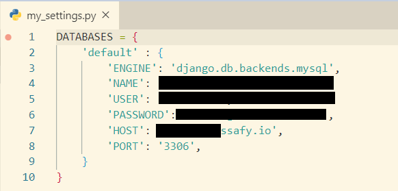

- 해보고 makemigrations를 해보면 성공!
- 하면 다행인데 우리는 잘 안됐다. 실패했다면 방화벽일 가능성이 크다. 방화벽을 풀러 가보자

##  에러 해결

> Special thanks to 신채린 코치님

### tcp로 전환

- MobaXTerm을 켜서 우분투 서버를 켜보자.

- 그 뒤 `netstat -nap`이라고 쳐보자. 뭔가를 설치해야된다고 뜨면 그대로 설치하면 된다.

- `netstat -nap`을 치면 이런저런 숫자가 쫙 뜬다. 당황스러울수 있지만 긍정적으로 생각하면 해커가 된 기분이다. 

- 많은 숫자들 중에서 위쪽으로 보면 tcp랑 tcp6 프로토콜들이 있다. 그 중 3306을 찾아보자

  ​	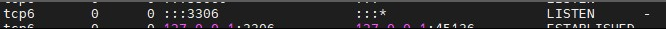

- 이런식으로 돼 있다면 문제가 있다고 한다. tcp6이 아니라 tcp로 떠야 한다. 왜냐면 우리는 tcp로 접속하려하고 있다고 한다.

- 아직 네트워크 지식이 모자라서 추후 공부할 예정.

- mysql설정을 바꾸러 가보자 `cd /etc/mysql/mysql.conf.d`

  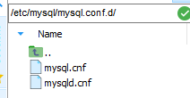

- `vi mysqld.cnf`를 써도 되고 편리한 mobaxterm은 걍 클릭해도 된다.

- 안에 보면 이런놈이 있다.

  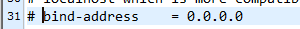

- 보면 주석해제 해주고 :wq로 나오자!

- 신날 줄 알았지만 아쉽게도 이후에도 해결이 되지 않았다.

### 방화벽 해제

- 방화벽 문제인듯 하다

- `sudo apt update && sudo apt install firewalld -y` 를 통해 필요한걸 설치하자. firewalld의 d는 오타가 아니다.

- `sudo firewall-cmd --permanent --zone=public --add-port=3306/tcp` 를 통해서 방화벽 제외해주고

- `sudo firewall-cmd --reload` 를 통해서 재시작

- `sudo firewall-cmd--list-all `를 쳐서

  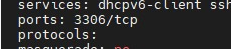

  가 나온다면 방화벽에서 제외된거다!! 혹시 안뜬다면 한번더 반복해야 될 수도 있다. 

- 이러고 나서 migrate하면 성공... mysql을 refresh해보면 장고의 기본 테이블들이 migrate된것을 확인 할 수 있다.

