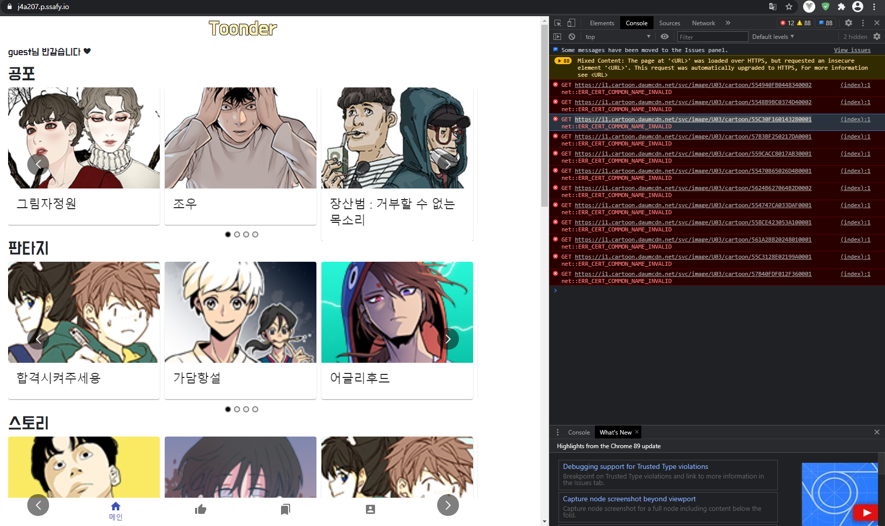
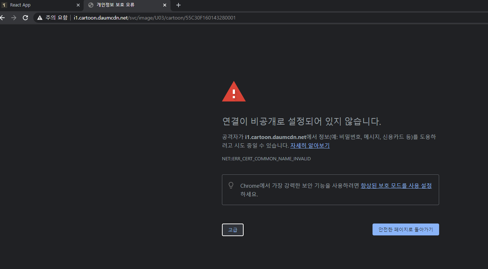
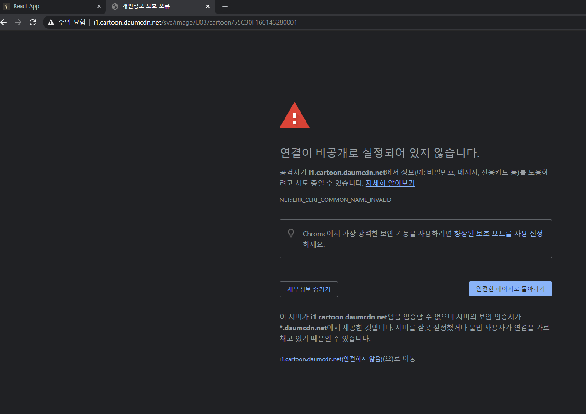
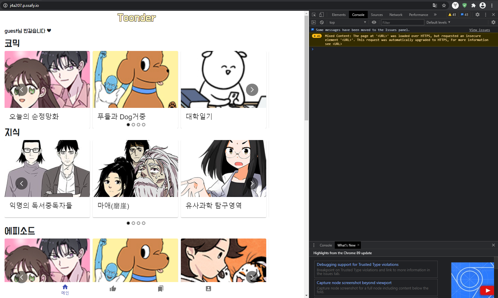

# Toonder

배포 주소 : https://j4a207.p.ssafy.io


### 1. 폴더 구조

```
exec
┠─────	backend
│		├ backend_main : django 설정이 들어있는 폴더
│		├ accounts : 계정 관리 앱
│		├ webtoons : DB에 있는 웹툰을 프론트로 보여주는 앱
│		└ recommends : 사용자에 따라서 웹툰을 추천해주는 앱
│
│
┗─────	frontend
```


### 2. backend

1. my_settings.zip을 압축해제 해야한다
   - 비밀번호 : `rlgusdldhkdkdlemf`


### 3. frontend

1. env.zip을 압축해제 해야한다
   - 비밀번호 : `rlgusdldmlclsrnemf`


### 4. 배포 사이트의 오류

#### 4.1 원인

- 다음 웹툰 측 ssl 오류


#### 4.2 해결법

1. F12를 누르고, 새로고침을 한다

2. 해당 위치의 주소를 복사한다

   

3. 주소에 붙여넣기 한 뒤, 고급 버튼을 누른다

   

4. 안전하지 않음으로 이동을 누른다.

   

5. 새로고침 한다

   

