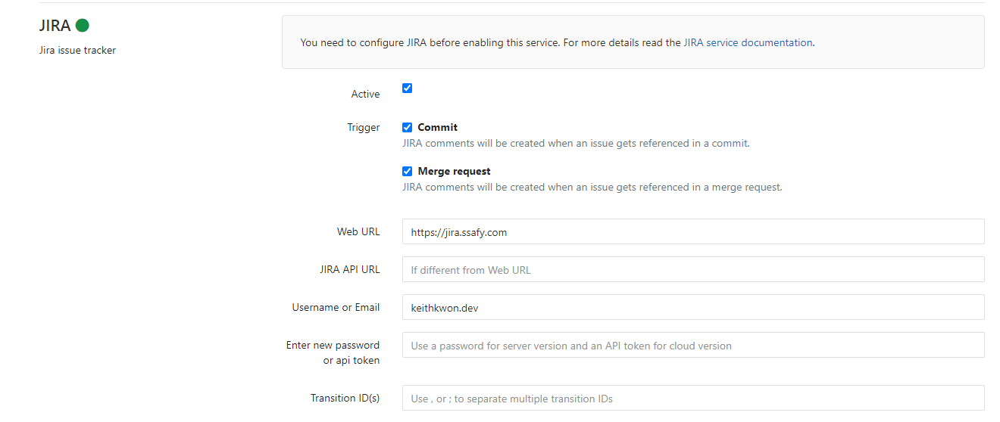

# Frontend

## 0315

### Frontend Setting

- `npx create-react-app frontend`
- `npm install react-router-dom`
- 상태관리를 위한 리덕스는 프로젝트 중반부 들어가서 결정하기로 함. 
- 패키지 매너지는 앞으로 `yarn`쓰기로 함. 
- material-ui 사용
  - `yarn add @material-ui/core`
  - `yarn add @material-ui/icons`

### Jira + Gitlab + Mattermost 연동

- gitlab - settings - integrations에서 jira 연동

- 

  ​	에서 비밀번호까지 설정해주면 추후에 이슈넘버를 포함한 커밋을 하면 자동으로 코멘트가 달린다.

- mattermost - 통합- 전체 incoming webhook 에서 create subscription
- 이후에 `/jira connect` 와 `/jira subscribe`를 하면 mattermost와 연동이 된다 .

### navbar

- `git branch FE/Navbar`
- 뭔가 루트폴더 설정하는 방법이 있었는데 까먹었다....
- 추가